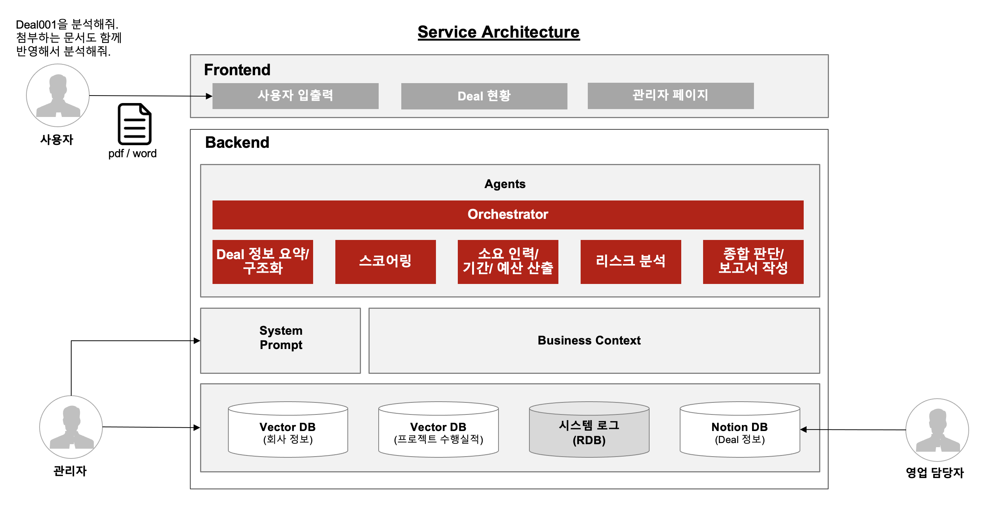
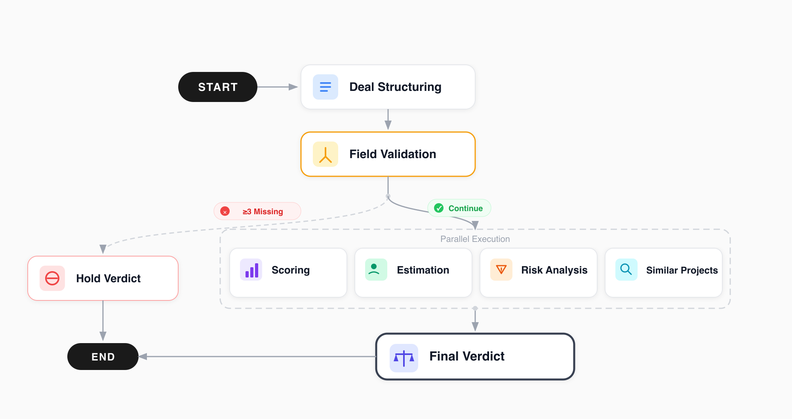

# OathKeeper

B2B AI development deal Go/No-Go decision support agent


### English | [한국어](docs/README(kr).md)


## Key Features

| Feature | Description |
|---|---|
| **Deal Parsing** | Auto-structures deal info from Notion, free text, and Word/PDF documents |
| **Automated Scoring** | Scores deals 0–100 across 7 criteria and renders Go/No-Go verdict |
| **Resource Estimation** | Calculates staffing, timeline, and budget based on company labor rates |
| **Risk Analysis** | Identifies and categorizes technical, schedule, financial, customer, and scope risks |
| **Similar Case Search** | Retrieves Top-3 similar past projects from vector DB (cosine similarity) |
| **Analysis Report** | Generates executive summary report and saves to Notion |


## System Architecture



### LangGraph Agent Flow

LangGraph-based analysis pipeline (`backend/app/agent/graph.py`):



Each node is implemented as a factory function under `backend/app/agent/nodes/` and shares state via `AgentState` (TypedDict). The conditional edge uses LangGraph's `Send` API for fan-out.


## Tech Stack

| Category | Technology |
|---|---|
| **Backend** | Python 3.12, FastAPI, Pydantic v2 |
| **AI Agent** | LangGraph, LiteLLM, LangChain |
| **LLM** | OpenAI GPT-4o / Claude Sonnet (via LiteLLM router) |
| **Vector DB** | Pinecone |
| **Database** | PostgreSQL 16 (SQLAlchemy 2.0 + asyncpg) |
| **Migrations** | Alembic |
| **Frontend** | Next.js 16, React 19, TypeScript 5, TailwindCSS v4, shadcn/ui |
| **Integration** | Notion API |
| **Deployment** | Docker Compose, Nginx |


## Project Structure

```
oathkeeper/
├── backend/
│   └── app/
│       ├── api/                     # FastAPI routers, Pydantic schemas
│       │   ├── routers/
│       │   └── schemas/
│       ├── agent/                   # LangGraph agent
│       │   ├── graph.py             # Main graph definition
│       │   ├── state.py             # AgentState (shared state)
│       │   ├── llm.py               # LLM client (LiteLLM)
│       │   ├── prompt_loader.py     # YAML prompt loader (Jinja2)
│       │   └── nodes/               # Individual agent nodes
│       ├── db/                      # Database layer
│       │   ├── models/
│       │   ├── repositories/
│       │   ├── migrations/
│       │   ├── vector_store.py
│       │   ├── pinecone_client.py
│       │   └── seed.py              # Seed data
│       ├── services/                # Business logic services
│       │   └── project_history_service.py
│       ├── integrations/            # External service clients
│       │   ├── notion_client.py
│       │   ├── notion_service.py
│       │   └── slack_client.py
│       └── utils/
│           ├── settings.py          # App settings (env vars)
│           ├── path.py              # Project path constants
│           ├── logging.py           # structlog setup
│           └── file_parser.py       # Document parsing (Word/PDF)
├── configs/
│   └── prompts/                     # Agent prompt YAML templates
├── frontend/
│   └── src/
│
├── tests/
│
├── docs/                       # Documentation
├── nginx/                      # Nginx reverse proxy config
├── main.py                     # Entrypoint (uvicorn)
├── Makefile
├── Dockerfile
├── docker-compose.yaml
├── docker-compose.prod.yaml
└── pyproject.toml
```


## Quick Start

### Prerequisites

- Python 3.12+
- [uv](https://docs.astral.sh/uv/) package manager
- Node.js 18+ (frontend)
- Docker & Docker Compose (database)

### Backend

```bash
# Clone repository
git clone https://github.com/your-org/oathkeeper.git
cd oathkeeper

# Initialize environment
make init

# Configure environment variables
cp .env.example .env

# Start database, run migrations, and seed data
make docker-up
make migrate
make seed

# Start backend server
make run
```

### Frontend

```bash
cd frontend
npm install
npm run dev
```

For detailed environment setup including API keys and external service configuration, see the [Environment Setup Guide](docs/manual/env-setting(en).md).


## Documentation

| Document | Link |
|---|---|
| Environment Setup (English) | [docs/manual/env-setting(en).md](docs/manual/env-setting(en).md) |
| Environment Setup (Korean) | [docs/manual/env-setting(kr).md](docs/manual/env-setting(kr).md) |
| User Manual (English) | [docs/manual/manual(en).md](docs/manual/manual(en).md) |
| User Manual (Korean) | [docs/manual/manual(kr).md](docs/manual/manual(kr).md) |
| Korean README | [docs/README(kr).md](docs/README(kr).md) |


## License

Private — All rights reserved.
