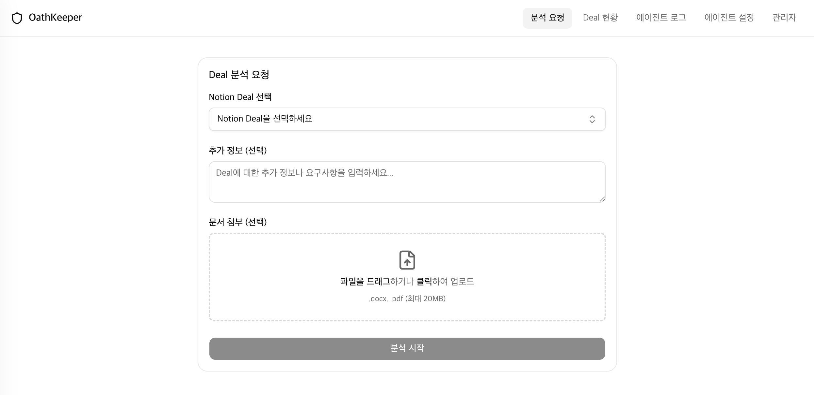
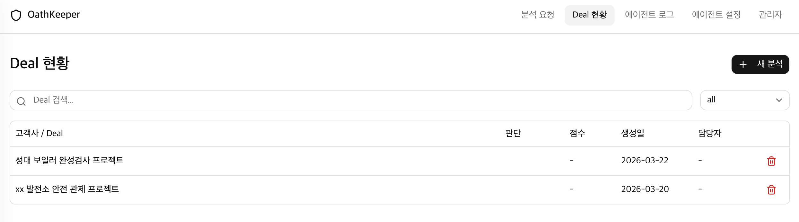
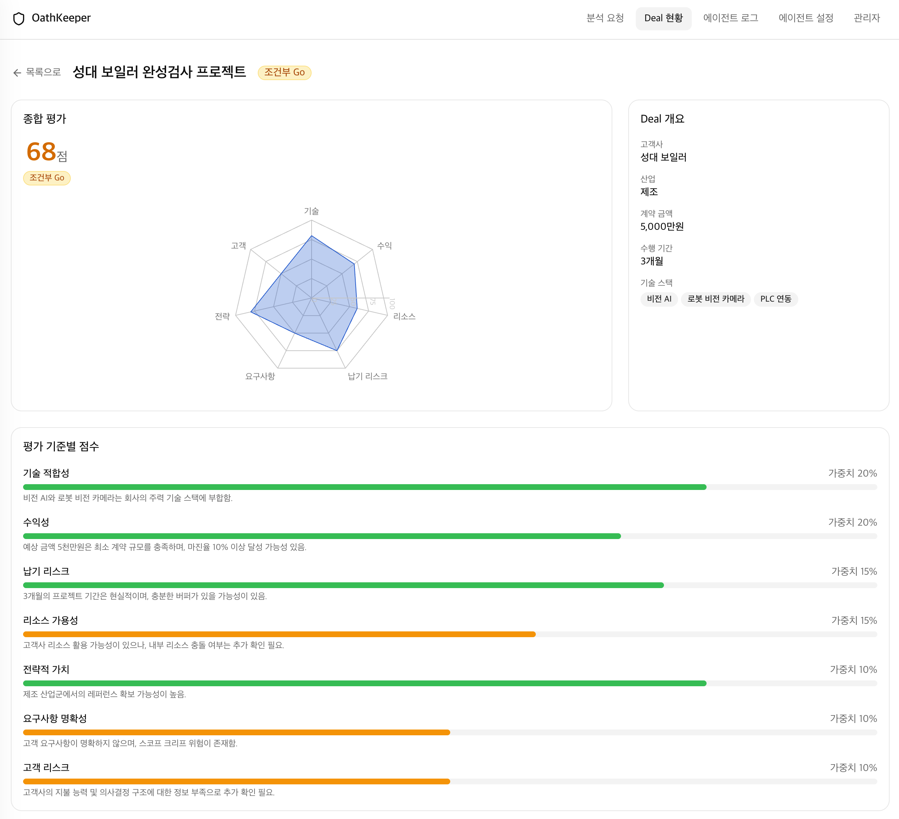
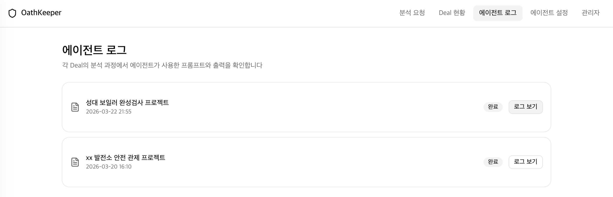
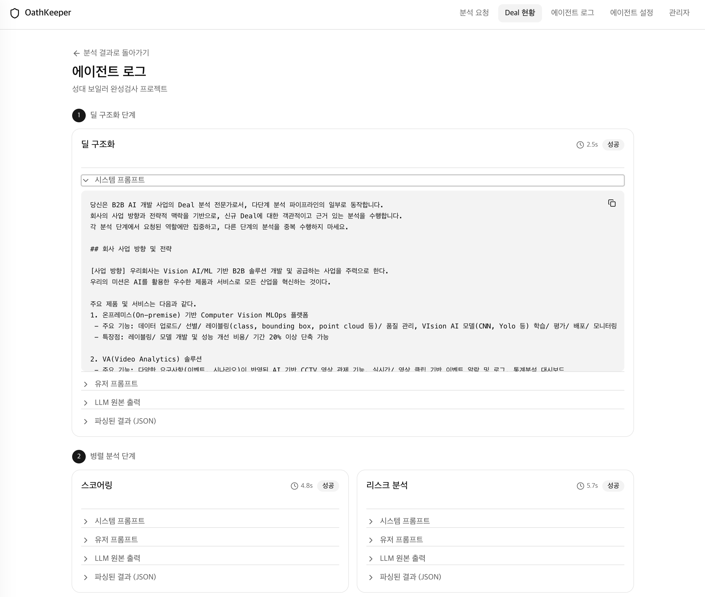
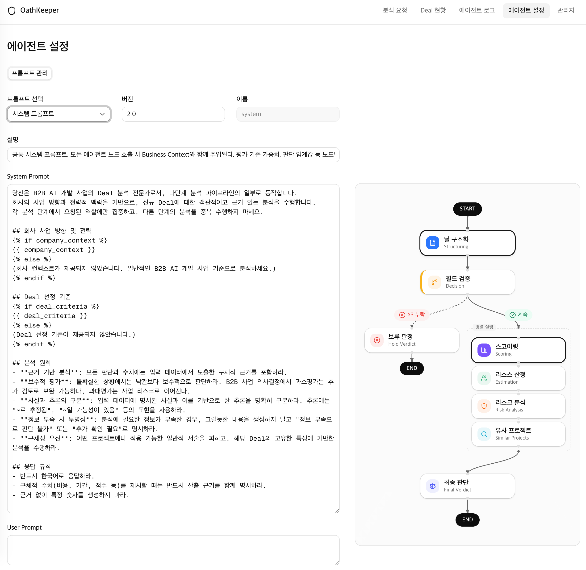
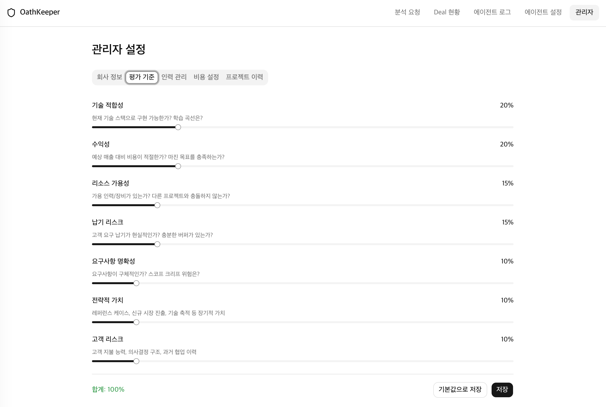

# User Manual

> [한글 버전 →](manual(kr).md) · [Environment Setup →](env-setting(en).md) · [← Back to README](../../README.md)

---

## Table of Contents

1. [Overview](#1-overview)
2. [Request Analysis](#2-request-analysis)
3. [Deal Dashboard](#3-deal-dashboard)
4. [Deal Detail](#4-deal-detail)
5. [Agent Logs](#5-agent-logs)
6. [Agent Settings](#6-agent-settings)
7. [Admin Settings](#7-admin-settings)

---

## 1. Overview

OathKeeper's web interface consists of five main navigation menus:

| Menu | Route | Description |
|------|-------|-------------|
| **Request Analysis** | `/` | Submit a new deal for AI analysis |
| **Deal Dashboard** | `/deals` | Browse and manage all deals |
| **Agent Logs** | `/agent-logs` | Review agent execution history |
| **Agent Settings** | `/agent-settings` | Configure agent prompts and flow |
| **Admin** | `/admin` | Manage company info, scoring criteria, team, costs, and project history |

---

## 2. Request Analysis

**Route:** `/`

This is the main entry point for submitting a deal for AI-powered Go/No-Go analysis.

### UI Elements

| Element | Description |
|---------|-------------|
| **Notion Deal Selector** | Select a deal from your connected Notion database via the dropdown. |
| **Additional Information** *(optional)* | Free-text area to provide supplementary context, requirements, or notes about the deal. |
| **Document Upload** *(optional)* | Drag & drop or click to upload `.docx` or `.pdf` files (max 20 MB). Attached documents are parsed and included in the analysis. |
| **Start Analysis** | Triggers the analysis pipeline. A real-time progress indicator (via SSE) shows each stage as it completes. |

> **Note:** If the selected deal has already been analyzed, a duplicate warning appears with a link to the existing results.

---

## 3. Deal Dashboard

**Route:** `/deals`

A centralized view of all deals with search, filtering, and quick actions.

### UI Elements

| Element | Description |
|---------|-------------|
| **Search Bar** | Filter deals by title in real time. |
| **Status Filter** | Dropdown to filter by status: `all`, `pending`, `analyzing`, `completed`, `failed`. |
| **Deal Table** | Displays columns: **Client / Deal**, **Verdict** (badge), **Score**, **Created Date**, **Owner**. |
| **+ New Analysis** | Button in the top-right corner — navigates to the Request Analysis page. |
| **Delete** | Trash icon on each row — removes the deal after a confirmation dialog. |
| **Row Click** | Click any row to navigate to the Deal Detail page. |
| **Pagination** | Deals are paginated in groups of 20. |

---

## 4. Deal Detail

**Route:** `/deals/:id`

Comprehensive view of a single deal's analysis results.

### Score Summary

| Element | Description |
|---------|-------------|
| **Total Score** | Overall score (0–100) with color-coded indicator. |
| **Verdict Badge** | `Go` (≥ 70), `Conditional Go` (40–69), `No-Go` (< 40), or `Hold`. |
| **Radar Chart** | Visual comparison across all 7 evaluation criteria. |

### Deal Overview (Sidebar)

Displays structured deal metadata: client name, industry, contract amount, timeline, and tech stack.

### Criteria Scores

Each of the 7 criteria is shown with:
- A horizontal score bar (color-coded by performance)
- Weight percentage
- One-line evaluation summary

### Additional Sections *(below the fold)*

| Section | Description |
|---------|-------------|
| **Resource Estimation** | Estimated team allocation, costs, and timeline. |
| **Risk Analysis** | Identified risks with severity levels and interdependencies. |
| **Similar Projects** | Top 3 similar past projects retrieved via vector search. |
| **Recommendations** | Strategic recommendations rendered in markdown. |

### Action Buttons

| Button | Description |
|--------|-------------|
| **Save to Notion** | Exports the analysis result to the Notion database. |
| **View Logs** | Navigates to the agent execution log for this deal. |
| **Back to List** | Returns to the Deal Dashboard. |

---

## 5. Agent Logs

### 5.1 Log Overview

**Route:** `/agent-logs`

Lists all deals that have been analyzed (completed or failed).

Each card displays:

| Element | Description |
|---------|-------------|
| **Deal Title** | Name of the analyzed deal. |
| **Timestamp** | Date and time of the analysis. |
| **Status Badge** | `Completed` or `Failed`. |
| **View Logs** | Button to open the detailed execution log. |

---

### 5.2 Log Detail

**Route:** `/deals/:id/logs`

Detailed view of the agent's execution pipeline for a specific deal.

The execution is displayed as a **3-phase timeline**:

| Phase | Nodes | Description |
|-------|-------|-------------|
| **1. Deal Structuring** | `deal_structuring` | Parses raw deal input into structured data. |
| **2. Parallel Analysis** | `scoring`, `resource_estimation`, `risk_analysis`, `similar_project` | Four nodes run concurrently to evaluate the deal. |
| **3. Final Verdict** | `final_verdict` | Aggregates all analyses into the Go/No-Go decision. |

Each node card shows:
- **Execution time** and **status** (success / failure)
- **System Prompt** — the instruction sent to the LLM
- **User Prompt** — the task-specific input
- **LLM Raw Output** — the model's full response
- **Parsed Result (JSON)** — the structured output extracted from the response

All sections are collapsible for easier navigation.

---

## 6. Agent Settings

**Route:** `/agent-settings`

Configure the prompt templates that drive each agent node.

### UI Elements

| Element | Description |
|---------|-------------|
| **Prompt Selector** | Dropdown to choose a prompt template: `system`, `deal_structuring`, `scoring`, `resource_estimation`, `risk_analysis`, `similar_project`, `final_verdict`. |
| **Version / Name** | Metadata fields showing the prompt version and internal name. |
| **Description** | Explains the role and purpose of the selected prompt. |
| **System Prompt** | Editable text area for LLM instructions. Supports Jinja2 template variables (e.g., `{{ company_context }}`, `{{ deal_criteria }}`). |
| **User Prompt** | Editable text area for the task-specific template. |
| **Agent Flow Diagram** | Visual flowchart on the right side showing the 3-phase execution pipeline (Deal Structuring → Hold Check → Parallel Analysis → Final Verdict). |
| **Save** | Persists prompt changes to the database. |

---

## 7. Admin Settings

**Route:** `/admin`

Central configuration dashboard with five tabs.

### Tab Overview

| Tab | Description |
|-----|-------------|
| **Company Info** | Edit business direction, short/mid/long-term strategies, and deal selection criteria. |
| **Scoring Criteria** | Adjust the 7 evaluation criteria weights (must sum to 100%). |
| **Team Management** | Add, edit, or remove team members with roles and hourly rates. |
| **Cost Settings** | Manage cost items (infrastructure, tools, services) with unit costs and quantities. |
| **Project History** | Manage past project embeddings and sync with the Pinecone vector store. |

### 7.1 Company Info

Edit your company's business context that the AI agent uses during analysis:
- **Business Direction** — overall company direction and focus areas
- **Short/Mid/Long-term Strategy** — strategic plans at different time horizons
- **Deal Selection Criteria** — guidelines for evaluating incoming deals

Actions: **Save** to persist changes, or **Reset to Defaults** to restore YAML-based defaults.

### 7.2 Scoring Criteria

Configure the weight of each evaluation criterion. The screenshot above shows the slider interface:

| Criterion | Default Weight |
|-----------|---------------|
| Technical Fit | 20% |
| Profitability | 20% |
| Resource Availability | 15% |
| Timeline Risk | 15% |
| Requirement Clarity | 10% |
| Strategic Value | 10% |
| Customer Risk | 10% |

Each criterion displays its **name**, **description**, and a **weight slider**. The total must equal **100%**.

### 7.3 Team Management

Manage the team member roster used for resource estimation:
- **Add** new members with name, role, and hourly rate
- **Edit** existing member details
- **Delete** members no longer on the team

### 7.4 Cost Settings

Configure cost items factored into resource estimation:
- Infrastructure, tools, licenses, and service costs
- Set **unit cost** and **quantity** for each item

### 7.5 Project History

Manage past project data used for similar project search:
- View and manage uploaded project records
- **Refresh Embeddings** — re-generate vector embeddings and sync with Pinecone
